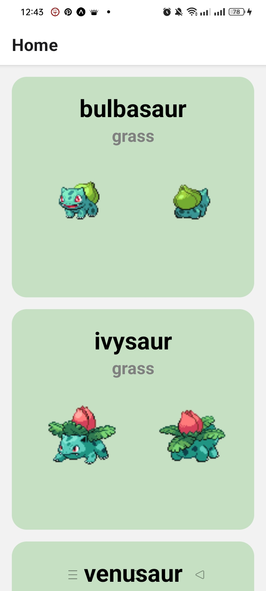

# Pokedex App — React Native + Expo

This project was developed as part of my learning journey in mobile development.  
I followed the tutorial **“React Native for Dummies 2026 – Full Beginner Crash Course”** and added my own improvements and modifications along the way.

---

## Technologies Used
- React Native
- Expo & Expo Go
- TypeScript
- Node.js
- TSX Components
- API Consumption (JSON)
- Hooks (useState, useEffect)

---

## Project Goal
Build a simple mobile application that lists Pokémon using the public **PokeAPI**, displaying their name, type, and images.

---

## What I Learned
Throughout the development, I practiced:
- Structuring React Native projects with Expo  
- Fetching external data  
- Rendering lists  
- Styling with `StyleSheet`  
- Navigation between screens  
- Component organization  
- TypeScript typing  

---

## Personal Improvements Added
- Layout and color adjustments  
- Additional comments  
- Component reorganization  
- Experiments with new features  

---

## How to Run
1. Install dependencies: npm install.
2. Start the project: npx expo start or npm run start.
3. Scan the QR Code using **Expo Go** on your phone.

---

## Screenshots

---

## Credits Tutorial Reference 
Base tutorial: *React Native for Dummies 2026 – Full Beginner Crash Course*  
YouTube link: [https://www.youtube.com/watch?v=BUXnASp_WyQ] by **Code with Beto**. 

This project soon will have more personal modifications and additional code written by me.

